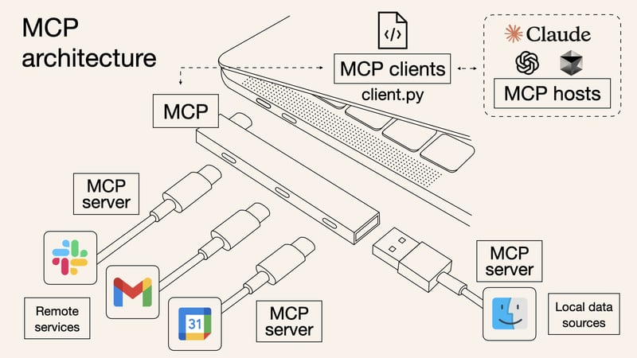
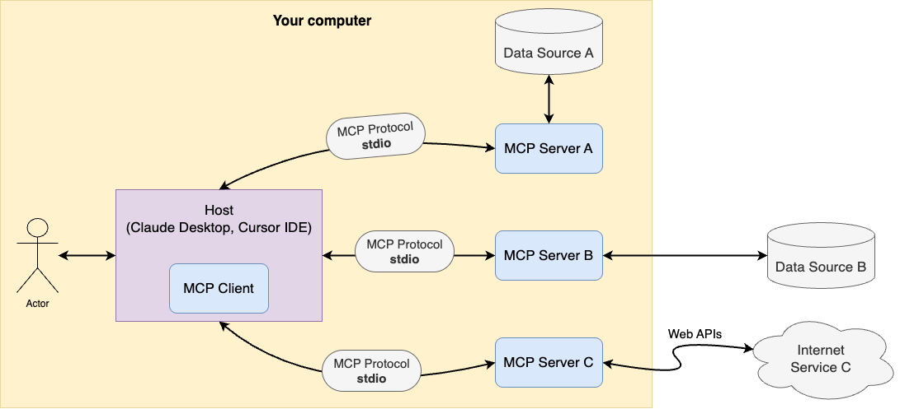

# mcp_tutorial

https://dev.to/shadow_b/understanding-mcp-model-context-protocol-with-examples-k75
https://habr.com/ru/articles/893482/
https://habr.com/ru/articles/899088/

Our Goals:

1. Explore what MCP is and how to use it
2. Build an MCP server that can run outside your local machine - for example, in a Kubernetes cluster
3. Create an MCP client that uses an LLM to communicate with our server

## What is MCP ?

No one can explain MCP better than its developers themselves: https://modelcontextprotocol.io/introduction

But I’ll do my best to summarize it.

MCP (Model Context Protocol) is a standard introduced by Anthropic in 2024. Its main goal is to standardize how
applications provide context to LLMs. Anthropic describes it as the “USB-C port for AI apps.”

In this article, we’ll take a closer look at MCP and even build our own MCP server and client.

## Why is MCP needed?

https://mcp.so/

## What's inside?

The main purpose of MCP is to unify how applications share context with LLMs.

*“Context”* includes everything a model needs to respond meaningfully: conversation history, prompt instructions,
external
data (like search results if the model can “Google”), and memory of past interactions.

MCP answers a key question: How can we give a model access to the data it needs—wherever that data lives? Whether it’s
in files, corporate applications, knowledge bases, or databases, MCP provides a standardized way to connect it.

Instead of relying on a messy patchwork of custom integrations, MCP offers a single protocol that simplifies and speeds
up connecting new data sources.

The architecture follows a familiar client-server model, but with an AI specific.
It’s tailored specifically for the needs of large language models.

At its core, it’s built around a triad:

* MCP Hosts: Programs like Claude Desktop, IDEs like Cursor IDE, or AI tools that want to access data through MCP
* MCP Clients: Protocol clients that maintain 1:1 connections with servers
* MCP Servers: Lightweight programs that each expose specific capabilities through the standardized Model Context
  Protocol

MCP also gives models access to two key types of resources:

* Data Sources: Your computer’s files, databases, and services that MCP servers can securely access
* Remote Services: External systems available over the internet (e.g., through APIs) that MCP servers can connect to

## The building blocks of context in MCP

### Messages

At the heart of MCP is a simple but powerful idea: dialogue.

MCP structures conversations as a sequence of messages, each with a clearly defined role:

* User – That’s us, the humans asking questions or giving instructions.
* Assistant – The AI model responding to us.
* System – System-level instructions that guide the model’s behavior (e.g., “Answer as a polite assistant” or “Only use
the provided documents”).
* Tool – Messages representing the output of external tools or services that the MCP server interacts with.

Each message contains text and can optionally include metadata like timestamps, language, priority, and more.

System messages are particularly important—they set the tone and rules for the interaction. For example:
“Respond as a helpful assistant.”
“Only base your answer on the attached documentation.”

This structure helps control how the model behaves and provides some protection against prompt injection attacks.
However, it’s important to understand that AI models can still be tricked, and there’s no guarantee they’ll follow
instructions perfectly every time.

Assistant messages can also include a “chain of thoughts” - essentially the model’s internal reasoning or action
plan—stored in the message’s metadata.

### Tools: External Services the Model Can Use

Tools in MCP are essentially external functions or services that the model can call when it needs help beyond its
built-in capabilities.

Each tool is defined by the MCP server with three key elements:
* A name
* A clear description, so the model understands when to use it
* A parameter schema that defines what kind of inputs the tool expects

For example, you might define a tool called “Japan Economic Database 2000–2025” with a description like:
“Use this tool if you need any data about the Japanese economy over the past 25 years.”

You’d also specify the parameters it can accept—like a date range, economic indicator, or region.

Once the model receives the list of available tools, it decides which one (if any) fits the user’s request. When it
wants to use one, it responds with something like:
“I want to call tool X with these parameters.”

The MCP client intercepts this response, sends the request to the appropriate MCP server, which runs the tool and
returns the result. That result—whether it’s data from an API, a database query, or something else - is added back into
the conversation as a message with the tool role.

From there, the model picks up the conversation again, now with the new information in hand.

MCP standardizes the entire tool interaction lifecycle—declaration, invocation, error handling, and result delivery.
This makes it possible to build complex chains of actions: the model can call multiple tools in sequence, with each step
depending on the previous one.

### Memory: Giving the Assistant a Long-Term Brain

Wouldn’t it be nice if the assistant could remember important things between sessions?

MCP makes that possible through memory servers—special services that can store notes, facts, or vectorized data for
semantic search.

There are already example implementations on GitHub, from Anthropic and others, under names like Memory Banks, Memory
Boxes, and more. These servers expose tools that the model can call to save information (save_memory) or later recall
it (search_memory).

This gives LLMs something like long-term memory—allowing them to retain user preferences, project details, or key facts
across sessions. Importantly, all memory data is stored server-side, which is essential for privacy and control.

MCP also helps manage short-term memory. When a dialogue gets too long to fit in the model’s context window, the Context
Manager can step in to compress or summarize the history—preserving the most important information while discarding less
relevant details.

### Files & Resources

In addition to calling tools, the model often needs to access static data like files, database entries, API responses,
or logs. In MCP, these are referred to as resources.

Resources are announced by the server using URI schemes, such as:
* file:///path/doc.txt
* database://customers/123

(Quick note: Earlier, we described a database as a tool. That’s accurate when there’s an API sitting on top of it. But
it can also be treated as a resource, depending on what fits best for your application.)

The model can request the contents of a resource, much like making a simple GET request. Unlike tools, resources are
typically read-only—they don’t modify state. Tools, on the other hand, can run logic and change things however they
need.

A classic example of a resource is the file system. Anthropic has released a ready-to-use
[Filesystem MCP server](https://modelcontextprotocol.io/quickstart/user), which lets Claude securely access files on
a user’s machine. However, it’s currently limited to Claude Desktop and isn’t suitable for real production workflows.

### Prompts

Beyond basic system messages, MCP introduces the concept of Prompts—predefined interaction templates for common tasks.

These are more than just static instructions—they’re structured workflows that guide the model through specific patterns of interaction. Prompts can be combined and chained to form more complex behaviors.

For example, a “log analysis” prompt might include:
	1.	Searching logs using a tool like Elasticsearch
	2.	Summarizing the findings (handled by the model itself)
	3.	Generating a conclusion or report based on a predefined format

MCP allows you to explicitly define and declare these prompt sequences, enabling models to tackle complex tasks in a controlled, repeatable way.

As you may have noticed, MCP turns generative AI into something much bigger than just a chatbot.

Don’t believe me?
Check it out for yourself: https://mcp.so — you’ll find tons of MCP-driven servers and clients built for all kinds of use cases.

Want to manage your data with LLMs using a Redis server? ✅

Need to search GitHub through an AI-powered interface? ✅

The ecosystem is growing fast and it’s just getting started.

### Transports

https://modelcontextprotocol.io/docs/concepts/transports#standard-input-output-stdio

MCP supports 2 types of transport

#### stdio

The stdio transport enables communication through standard input and output streams.

Use stdio when:

* Building command-line tools
* Implementing local integrations
* Testing your server and client

⚠️ Important:
Avoid using stdio transport in Kubernetes, OpenShift clusters, or even in Docker Compose setups running on a single
server. It’s not designed for inter-process communication across containers or distributed environments.

There are lots of stdio servers and clients examples in the net. Therefore, I will not focus on this.
You can check an example of stdio mcp server and client implementation at [stdio](stdio)

#### sse

Start server:

~~~
python3 -m server
~~~