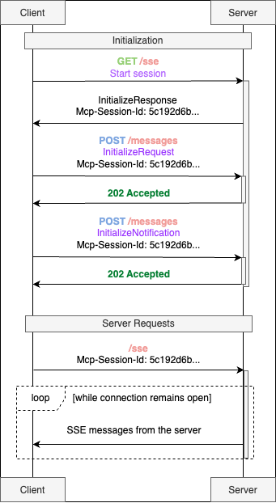
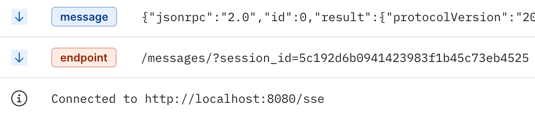

# mcp_tutorial

> Ever wished your AI assistant could actually do more than just chat? Like send real emails, schedule your meetings,
> analyze your spreadsheets, or search the web for you? The Model Context Protocol (MCP) aims to make this possible, but
> is it really revolutionary?

In this tutorial, we will:

1. Explore what MCP is and why we need it
2. Dive in and understand how the protocol works under the hood
2. Build an MCP server that can run outside your local machine - for example, in a Kubernetes cluster
3. Create an MCP client that uses an LLM to communicate with our server

Let's dive in!

## What is MCP and why do we need it ?

Modern AI assistants like ChatGPT, Claude, and Gemini can generate fluent, intelligent responses—but when it comes to
working with real-world data, they often fall short. Despite their conversational brilliance, these models operate in an
“information vacuum,” struggling to interact seamlessly with external tools, APIs, or databases. For anyone who’s tried
integrating a language model with a live service, the process can feel frustratingly inconsistent—like dealing with a
drawer full of proprietary phone chargers before USB-C.

That’s where the Model Context Protocol (MCP) comes in. Introduced by Anthropic in November 2024, MCP is a universal
standard designed to give AI models structured, contextual access to external information. Think of it as the USB-C of
AI: a clean, standardized connector between smart assistants and the data ecosystems they’re meant to work within.

The main goal of MCP is to unify how applications share *context* with large language models. That context can include
anything from conversation history and prompt instructions to real-time search results, proprietary data, or even memory
from past interactions. Whether the relevant information lives in a file system, corporate application, database, or
internal knowledge base, MCP provides a single, consistent way to surface it to the model.

By replacing a patchwork of custom integrations with a common protocol, MCP makes it faster and easier to connect LLMs
to the real world. In a landscape overflowing with fragmented solutions, it’s a long-overdue step toward making AI not
just smart—but truly useful.

## What's inside?

The architecture follows a familiar client-server model, but with an AI specific.
It’s tailored specifically for the needs of large language models.

At its core, it’s built around a triad:

* MCP Hosts: Programs like Claude Desktop, IDEs like Cursor IDE, or AI tools that want to access data through MCP
* MCP Clients: Protocol clients that maintain 1:1 connections with servers
* MCP Servers: Lightweight programs that each expose specific capabilities through the standardized Model Context
  Protocol

MCP also gives models access to two key types of resources:

* Data Sources: Your computer’s files, databases, and services that MCP servers can securely access
* Remote Services: External systems available over the internet (e.g., through APIs) that MCP servers can connect to

____

## Transports

MCP uses JSON-RPC 2.0 as its wire format.

The transport layer is responsible for converting MCP protocol messages into
JSON-RPC format for transmission and converting received JSON-RPC messages back into MCP protocol messages.

There are three types of JSON-RPC messages used:

1) **Requests**
2) **Responses**
3) **Notifications**

MCP includes two standard [transport](https://modelcontextprotocol.io/docs/concepts/transports) implementations:

### SSE - Production Ready

There are 4 main strategies for client-server communication in **real time**:

| Method                   | Connection        | Bidirectional | Latency | Server Load | Usage                                                |
|--------------------------|-------------------|---------------|---------|-------------|------------------------------------------------------|
| WebSocket                | Persistent        | Yes           | Low     | Low         | Chats, online games, stock trading platforms         |
| SSE (Server-Sent Events) | Persistent        | No            | Low     | Low         | News feeds, notifications                            |
| Long Polling             | Repeated requests | No            | Medium  | Medium      | Notifications, chats (if WebSocket is not available) |
| Short Polling            | Periodic requests | No            | High    | High        | Data updates with infrequent changes                 |

**REST API ≠ REAL TIME**. It's completely different types of communications.

| Feature                             | Method        | Endpoint                          | Protocol | Description                                           |
|-------------------------------------|---------------|-----------------------------------|----------|-------------------------------------------------------|
| Get user profile                    | `GET`         | `/api/users/:id`                  | REST     | Fetch profile info for a specific user                |
| Post a new status update            | `POST`        | `/api/posts`                      | REST     | Create a new post                                     |
| Like a post                         | `POST`        | `/api/posts/:id/like`             | REST     | Like someone’s post                                   |
| Follow another user                 | `POST`        | `/api/users/:id/follow`           | REST     | Follow a user                                         |
| Real-time feed of new posts         | `EventStream` | `/stream/feed`                    | SSE      | Live updates when people you follow publish new posts |
| Live notifications (likes/comments) | `EventStream` | `/stream/notifications`           | SSE      | Get notified instantly when someone likes or comments |
| Typing indicator in comments        | `EventStream` | `/stream/typing-comments/:postId` | SSE      | See “User is typing...” in real time under a post     |
| Live online status of friends       | `EventStream` | `/stream/friends-status`          | SSE      | Get notified when friends go online or offline        |

**SSE (Server-Sent Events)** is a push technology (communication is initiated by the server, not the client) that allows
the client to receive automatic updates from the server via HTTP connections.

Okay, so how does it work?

<table>
  <tr>
    <td>
      
    </td>
    <td>

**MCP session initialization**

1. The client starts the SSE session.
2. The server responds with a session ID
   (e.g., Mcp-Session-Id: 5c192d6b...), which will be used in all subsequent communications.
3. The client sends an initialization request—similar to a TCP handshake.
4. The client also sends an MCP Notifications initialization request—again, like a handshake in TCP.

The `/sse` route represents the SSE session I mentioned earlier. *It’s kept open the entire time we communicate with the
MCP server.*

As soon as the SSE session starts, server immediately responds us with 2 messages:

* `message` - [the server description](examples/server_description.json)
* `endpoint` - the server endpoint used for MCP communication

  </td>

  </tr>

<tr>
    <td>
      
    </td>
    <td>

**MCP Request-Response**

1. The client asks server which tools, resources or prompts are available
2. The client sends a request to the server.

The server can either:

* Respond with a single HTTP response
* Open an SSE stream (server continuously pushes messages to the client)

  </td>

  </tr>

<tr>
    <td>
      
    </td>
    <td>

**MCP Notifications**

Servers can notify clients when their list of available resources changes via the
`notifications/resources/list_changed notification`

Clients can subscribe to updates for specific resources:

1. Client sends `resources/subscribe` with resource URI
2. Server sends `notifications/resources/updated` when the resource changes
3. Client can fetch latest content with `resources/read`
4. Client can unsubscribe with `resources/unsubscribe`

For long-term operations, the MCP supports a progress tracking mechanism. When initiating such an operation, the client
can include a progress Token in the request. In response, the server can send `notifications/progress` notifications
containing the current progress and, if available, the total number of steps. This allows the client to inform the user
about the current status of the task.

 </td>

  </tr>

</table>

Python implementation example: [sse example](sse)

### stdio

The stdio transport enables communication through standard input and output streams.

✅ **Use stdio when:**

* Building command-line tools
* Implementing local integrations
* Testing your server and client

⚠️ **Avoid using stdio in distributed environments**:

stdio transport is not designed for inter-process communication across containers. Therefore, it’s a poor choice for
environments like Kubernetes or OpenShift clusters.

There are lots of stdio servers and clients examples in the net. Therefore, I will not focus on this.
You can check an example of stdio mcp server and client implementation at [stdio](stdio)

### Authorization

Authorization is `OPTIONAL` for MCP implementations. When supported:

* Implementations using an HTTP-based transport `SHOULD` conform to this specification.
* Implementations using an STDIO transport `SHOULD NOT` follow this specification, and instead retrieve credentials from
  the environment.
* Implementations using alternative transports `MUST` follow established security best practices for their protocol.

The Model Context Protocol provides authorization capabilities at the transport level, enabling MCP clients to make
requests to restricted MCP servers on behalf of resource owners.

If you’re using Kubernetes or OpenShift with the Istio framework, parsing HTTP traffic and implementing authorization
with mTLS or another mechanism won’t be an issue.

However, out of the box, MCP only supports the OAuth2 authentication protocol.

* [MCP OAuth2 Authorization](https://modelcontextprotocol.io/specification/2025-03-26/basic/authorization)
* [Cloudflare MCP OAuth flow](https://blog.cloudflare.com/remote-model-context-protocol-servers-mcp/)

____

## The building blocks of context in MCP

### Messages

At the heart of MCP is a simple but powerful idea: dialogue.

MCP structures conversations as a sequence of messages, each with a clearly defined role:

* User – That’s us, the humans asking questions or giving instructions.
* Assistant – The AI model responding to us.
* System – System-level instructions that guide the model’s behavior (e.g., “Answer as a polite assistant” or “Only use
  the provided documents”).
* Tool – Messages representing the output of external tools or services that the MCP server interacts with.

Each message contains text and can optionally include metadata like timestamps, language, priority, and more.

System messages are particularly important—they set the tone and rules for the interaction. For example:
“Respond as a helpful assistant.”
“Only base your answer on the attached documentation.”

This structure helps control how the model behaves and provides some protection against prompt injection attacks.
However, it’s important to understand that AI models can still be tricked, and there’s no guarantee they’ll follow
instructions perfectly every time.

Assistant messages can also include a “chain of thoughts” - essentially the model’s internal reasoning or action
plan—stored in the message’s metadata.

### Tools: External Services the Model Can Use

Tools in MCP are essentially external functions or services that the model can call when it needs help beyond its
built-in capabilities.

Each tool is defined by the MCP server with three key elements:

* A name
* A clear description, so the model understands when to use it
* A parameter schema that defines what kind of inputs the tool expects

~~~python
@mcp.tool()
async def get_alerts(state: str) -> str:
    """
    Get weather alerts for a US state.

    Args:
        state: Two-letter US state code (e.g. CA, NY)
    """
    pass

@mcp.tool()
def multiply(a: int, b: int) -> int:
    """
    Multiply two numbers
    """
    return a * b

@mcp.tool()
async def get_japan_economic_statistics() -> str:
    """
    Use this tool if you need any data about the Japanese economic over the past 25 years.
    """
    pass
~~~

[JsonRpc list tools example](examples/list_tools.json)

Once the model receives the list of available tools, it decides which one (if any) fits the user’s request. When it
wants to use one, it responds with something like:
“I want to call tool X with these parameters.”

The MCP client intercepts this response, sends the request to the appropriate MCP server, which runs the tool and
returns the result. That result - whether it’s data from an API, a database query, or something else - is added back
into the conversation as a message with the tool role.

From there, the model picks up the conversation again, now with the new information in hand.

MCP standardizes the entire tool interaction lifecycle—declaration, invocation, error handling, and result delivery.
This makes it possible to build complex chains of actions: the model can call multiple tools in sequence, with each step
depending on the previous one.

### Memory: Giving the Assistant a Long-Term Brain

Wouldn’t it be nice if the assistant could remember important things between sessions?

MCP makes that possible through `memory servers` - special services that can store notes, facts, or vectorized data for
semantic search.

There are already example implementations on GitHub, from Anthropic and others, under names like Memory Banks, Memory
Boxes, and more. These servers expose tools that the model can call to save information (save_memory) or later recall
it (search_memory).

As an example:

* https://docs.cline.bot/improving-your-prompting-skills/cline-memory-bank
* https://mcp.so/server/mcp-mem0/coleam00
* https://glama.ai/mcp/servers/@henryhawke/mcp-titan

This gives LLMs something like long-term memory—allowing them to retain user preferences, project details, or key facts
across sessions. Importantly, all memory data is stored server-side, which is essential for privacy and control.

MCP also helps manage short-term memory. When a dialogue gets too long to fit in the model’s context window, the Context
Manager can step in to compress or summarize the history—preserving the most important information while discarding less
relevant details.

_My attempts to find examples of MCP short-term memory have failed 😔 But MCP does officially declare support for such a
mechanism._

### Files & Resources

In addition to calling tools, the model often needs to access static data like files, database entries, API responses,
or logs. In MCP, these are referred to as resources.

Resources are announced by the server using URI schemes, such as:

* file:///path/doc.txt
* database://customers/123

(Quick note: Earlier, we described a database as a tool. That’s accurate when there’s an API sitting on top of it. But
it can also be treated as a resource, depending on what fits best for your application.)

The model can request the contents of a resource, much like making a simple GET request. Unlike tools, resources are
typically read-only—they don’t modify state. Tools, on the other hand, can run logic and change things however they
need.

A classic example of a resource is the file system. Anthropic has released a ready-to-use
[Filesystem MCP server](https://modelcontextprotocol.io/quickstart/user), which lets Claude securely access files on
a user’s machine. However, it’s currently limited to Claude Desktop and isn’t suitable for real production workflows.

### Prompts

Beyond basic system messages, MCP introduces the concept of Prompts—predefined interaction templates for common tasks.

These are more than just static instructions—they’re structured workflows that guide the model through specific patterns
of interaction. Prompts can be combined and chained to form more complex behaviors.

For example, a “log analysis” prompt might include:

1. Searching logs using a tool like Elasticsearch
2. Summarizing the findings (handled by the model itself)
3. Generating a conclusion or report based on a predefined format

MCP allows you to explicitly define and declare these prompt sequences, enabling models to tackle complex tasks in a
controlled, repeatable way.

## Summary

As you may have noticed, MCP turns generative AI into something much bigger than just a chatbot.

Don’t believe me?
Check it out for yourself: https://mcp.so — you’ll find tons of MCP-driven servers and clients built for all kinds of
use cases.

Want to manage your data with LLMs using a Redis server? ✅

Need to search GitHub through an AI-powered interface? ✅

The ecosystem is growing fast and it’s just getting started.

## Resources

* https://dev.to/shadow_b/understanding-mcp-model-context-protocol-with-examples-k75
* https://dev.to/zachary62/model-context-protocol-mcp-simply-explained-function-calling-rebranded-or-genuine-breakthrough-4c04
* https://dev.to/d04975d650beed571b/mcp-memory-bank-1jpm
* https://dev.to/sudhakar_punniyakotti/mcp-the-api-gateway-for-ai-agents-4ldn